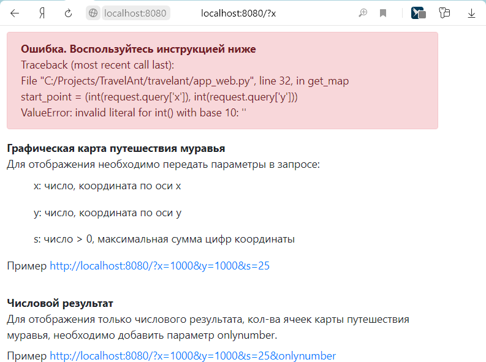

# travel-ant
Расчет карты путешествия муравья.

На бесконечной координатной сетке находится муравей. Муравей может перемещаться по одной клетке за шаг, в лево, право, 
вверх или вниз.
Клетки, в которых сумма цифр в координате X + сумма цифр в координате Y больше чем N недоступны.
Вычислить кол-во клеток достпуных для посещения муравью исходя из заданной начальной точки.

## Архитектура
Решение представлено в виде приложения интерфейса командной строки и web сервера генерирующего html страницу с 
отрисованной картой доступного путешествия муравья. 
В общее ядро выделен [модуль](travelant/travel.py) реализующий непосредственно расчет карты путешествия.  

#### [Утилита интерфейса командной строки](travelant/app_cmd.py)
 
В качестве параметра передаются исходные данные. В консоль выводится результат. 
```sh
app_cmd.py 1000 1000 25
148848
```

#### [Графическое решение](travelant/app_web.py)

Для реализации web сервера используется библиотека aiohttp.
В GET запрос, параметрами, передаются исходные данные. Обработчик запроса [вычисляет](travelant/travel.py) 
карту путишествия муравья и генерирует [html страницу](travelant/app_web_templates/map.jinja2), которая окончательно 
строится на стороне клиента.  
   
Запуск сервера
```sh
app_web.py
```

Отображение страницы с инструкцией


Отображение страницы с картой путешествия


Отображение страницы в случае возникновения ошибки




## Предполагаемые допущения, предложения и замечания

Исходный код содержит TODO с указанием того что возможно необходимо подправить и примечания при выборе того или иного 
варианта решения.  

Прочие рассуждения:

* Учитывая некоторую фрактальность результата, можно предположить что возможно ответ можно было бы получить  
путем генерации данных (в ряде случаев) по найденной схеме. Но считаю это не цель данной демонстрации     

* Решение на JavaScript в виде аналогичной python реализации не рассматривал. Не интересно было бы

* Учитывая передачу большого массива данных в виде сгенерированной страницы html, возможно представленные 
данные можно было бы передавать в более компактном виде. Но засчет повышенной обработки ресурсов на стороне пользователя 

* Необходимо реализовать паралельность обработки запросов

* Обрабокта исключений могла быть более детальной

* Необходимы юнит-тесты консольного приложения и веб сервера
