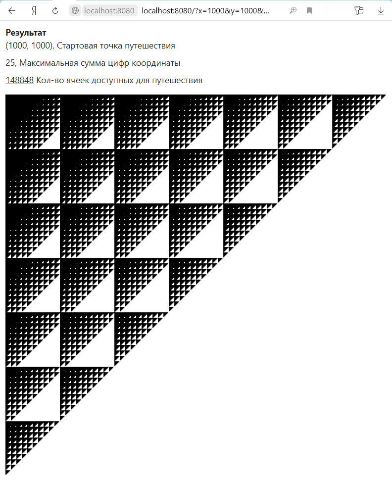

# travelant
Расчет карты путешествия муравья.

На бесконечной координатной сетке находится муравей. Муравей может перемещаться по одной клетке за шаг, в лево, право, 
вверх или вниз.
Клетки, в которых сумма цифр в координате X + сумма цифр в координате Y больше чем N недоступны.
Вычислить кол-во клеток достпуных для посещения муравью исходя из заданной начальной точки.

## Архитектура
Решение представлено в виде приложения интерфейса командной строки и web сервера генерирующего html страницу с 
отрисованной картой доступного путешествия муравья. 
В общее ядро выделен [модуль](travelant/travel.py) реализующий непосредственно расчет карты путешествия.  

#### [Утилита интерфейса командной строки](travelant/app_cmd.py)
 
В качестве параметра передаются исходные данные. В консоль выводится результат. 
```sh
app_cmd.py 1000 1000 25
148848
```

#### [Графическое решение](travelant/app_web.py)

Для реализации web сервера используется библиотека aiohttp.
В GET запрос, параметрами, передаются исходные данные. Обработчик запроса [вычисляет](travelant/travel.py) 
карту путишествия муравья и генерирует [html страницу](travelant/app_web_templates/map.jinja2), которая окончательно 
строится на стороне клиента.  
   
Запуск сервера
```sh
app_web.py
```

Отображение страницы с инструкцией


Отображение страницы с картой путешествия



Отображение страницы в случае возникновения ошибки


## Предлагаемые доработки

* Бинарный вид данных в протоколе обмена между клиентом и сервера. Для этого необходимо доработать понятия запроса, ответа, и ввести бмнарный тип содержимого запроса и тип результата ответа.

* Мета данные для команд. Сейчас перечень доступных команд на клиент передается в виде описания, как результат выполнения команды help. Текущее решение не достаточно в случае, если команда например требует подтверждения выполнения (например удаление директории). Необходимость такого подтверждения могли бы выполнять мета данные о поддерживаемых командах сервера, отправляемые на клиент. Прочитав которые js консоль могла бы осуществлять такие действия как - подтверждение выполнения, валидация введенных параметров еще на стороне клиента. В конце концов осуществлять проверку наличия команды, без необходимости обращения к серверу.  

* Командаы по ходу выполнения которых происходит запрос данных от пользователя. Реализация потребывала бы на стороне сервера ввода понятия - контекста выполнения команды, а так же в запросе указания идентификатора данного контекста либо исходной команды.

* Решить проблему с кодировками

и т.д.